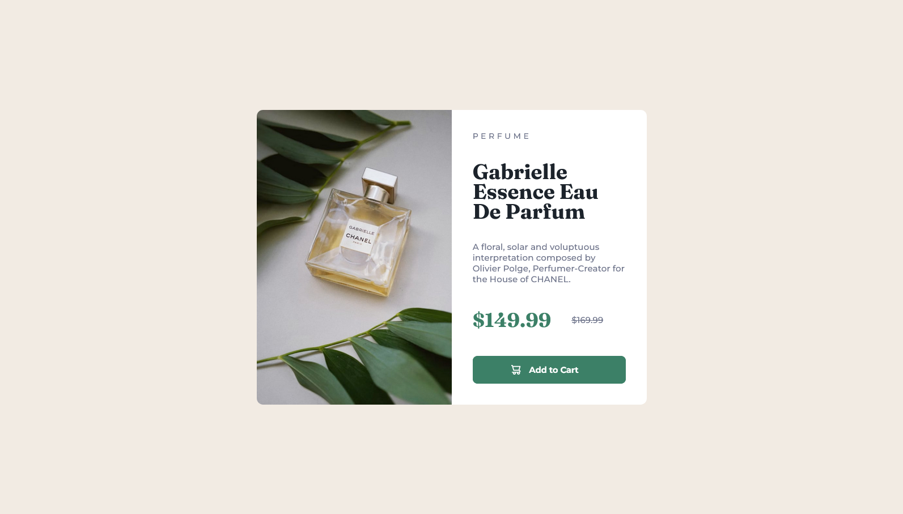

<!-- LINKS -->

## Links

- Solution URL: [Frontend Mentor Solution](https://www.frontendmentor.io/solutions/product-preview-responsive-flexbox-sass-bem--YhpCwmS3W)
- Live Site URL: [Live site](https://abestian.github.io/product_preview-FM/)

<!-- ABOUT THE PROJECT -->

## About The Project



The primary objective of this project was to design a responsive product preview card that seamlessly adapts to a range of screen sizes. The card showcases a product - in this case, a beautifully designed perfume flask - along with its price, offering a clear preview for users. A key challenge encountered during development was ensuring the layout dynamically adjusts across devices: on mobile screens, the image of the perfume flask is positioned above the text, while on larger desktop displays, it shifts to the left of the text.

<!-- BUILT WITH -->

## Built With

- Semantic HTML5 markup
- CSS custom properties
- Flexbox
- Mobile-first workflow
- SASS pre-processor
- [BEM methodology](https://getbem.com/)

<!-- ROADMAP -->

## Roadmap

- [x] Create the card view for mobile devices
- [x] Create the card view for desktop devices
- [x] Ensure responsibility across different screen sizes
- [x] Create hover/focus action for button

<!-- WHAT I LEARNED -->

## What I learned

I learned how to add responsiveness to image in html using picture tag.

```html
<picture>
	<source media="(min-width: Xpx)" srcset="../../image-desktop.jpg" />
	
</picture>
```

<!-- AUTHOR -->

## Author

Frontend Mentor - [@Abestian](https://www.frontendmentor.io/profile/Abestian)

<!-- USEFUL RESOURCES -->

## Useful resources

- [Info about flex-grow, flex-shrink and flex-basis](https://css-tricks.com/understanding-flex-grow-flex-shrink-and-flex-basis/)
- [Reddit post that helped me with responsive image](https://www.reddit.com/r/HTML/comments/o697ze/srcset_not_working_always_loads_desktop_version/)
- [Clamp](https://developer.mozilla.org/en-US/docs/Web/CSS/clamp)
